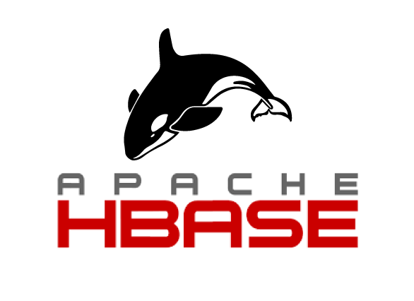

# Pengenalan NoSQL

## Apa itu NoSQL?

NoSQL adalah mekanisme untuk penyimpanan dan pengambilan data yang dimodelkan dengan cara selain relasi tabular yang digunakan dalam database relasional. NoSQL adalah cara baru berpikir tentang database. NoSQL bukan database relasional.

## Mengapa NoSQL?

NoSQL memiliki beberapa keuntungan dibandingkan database relasional, seperti:

- Skema dinamis: NoSQL memungkinkan Anda untuk menyimpan data dengan struktur yang bervariasi dan berubah-ubah, tanpa perlu mendefinisikan skema terlebih dahulu.
- Skalabilitas elastis: NoSQL dapat menyesuaikan ukuran dan performa database sesuai dengan permintaan dan beban kerja, dengan menambah atau mengurangi node secara otomatis.
- Kinerja lebih cepat: NoSQL dapat memproses data dengan latensi rendah dan throughput tinggi, terutama untuk data yang tidak terstruktur atau semi-terstruktur.

## Kategori NoSQL

NoSQL memiliki beberapa kategori berdasarkan jenis penyimpanan data yang digunakan, antara lain:

- Column-family: Menyimpan data per-kolom, cocok untuk pencarian yang kompleks dan analitik. Contoh: Apache Hadoop HBase.
- Key/value: Menyimpan data sebagai pasangan kunci dan nilai, cocok untuk cache dan penyimpanan sementara. Contoh: Redis.
- Graph: Memodelkan struktur relasi dari data, cocok untuk analisis jaringan dan data terhubung. Contoh: ArangoDB.
- Document-based: Menyimpan data sebagai dokumen, cocok untuk data tidak terstruktur atau semi-terstruktur. Contoh: Amazon DocumentDB.

## Perbandingan NoSQL dan Relasional DB

| NoSQL | Relasional DB |
| --- | --- |
| Skema dinamis | Skema ketat |
| Banyak tipe penyimpanan data | Data disimpan dalam tabel |
| Kebanyakan tidak mendukung ACID | Mendukung ACID |
| Data tidak konsisten | Data akurat dan utuh |
| Skalabilitas horizontal | Skalabilitas vertikal |
| Kinerja lebih cepat | Kinerja lebih lambat |

## Contoh NoSQL untuk Setiap Kategori

   
1. **Column-family NoSQL Database: Apache Hadoop HBase**
   - Apache Hadoop HBase adalah database Hadoop, yaitu penyimpanan data besar yang didistribusikan dan dapat diskalakan. HBase dirancang untuk menyimpan tabel yang sangat besar -- miliaran baris X jutaan kolom -- di atas kluster perangkat keras komoditas.
   - Use case: HBase biasanya digunakan untuk aplikasi real-time seperti pencarian dan analitik.
   - Keunggulan dan kekurangan:

   | Keunggulan | Kekurangan |
   | --- | --- |
   | Mendukung penyimpanan data dalam jumlah besar | Mungkin tidak cocok untuk aplikasi yang membutuhkan transaksi ACID |
   | Memiliki kemampuan untuk menangani akses baca/tulis secara real-time | Mungkin tidak cocok untuk operasi agregasi kompleks |
   

   
2. **Graph NoSQL Database: ArangoDB**
   - ArangoDB adalah database NoSQL yang didistribusikan dan bersifat native multi-model. ArangoDB mendukung tiga model data (grafik, dokumen JSON, pasangan kunci/nilai) dengan satu inti database dan bahasa query yang disatukan.
   - Use case: ArangoDB biasanya digunakan untuk aplikasi yang membutuhkan akses cepat ke data terhubung, seperti deteksi penipuan, manajemen rantai pasokan, analisis jaringan, dan lainnya.
   - Keunggulan dan kekurangan:

   | Keunggulan | Kekurangan |
   | --- | --- |
   | Menawarkan kinerja tinggi | Mungkin memerlukan pengetahuan khusus untuk digunakan secara efektif |
   | Fleksibel dalam model data | Mungkin tidak cocok untuk semua aplikasi |
   | Dapat diskalakan secara dinamis | |
   

   
3. **Document-based NoSQL Database: Amazon DocumentDB**
   - Amazon DocumentDB adalah layanan database NoSQL yang dikelola dan mendukung struktur data dokumen, dengan beberapa kompatibilitas dengan MongoDB.
   - Use case: Amazon DocumentDB biasanya digunakan untuk aplikasi yang membutuhkan respons latensi rendah, model data fleksibel, dan penskalaan elastis untuk beban kerja dinamis.
   - Keunggulan dan kekurangan:

   | Keunggulan | Kekurangan |
   | --- | --- |
   | Menawarkan kinerja tinggi | Mungkin memerlukan biaya tambahan untuk penggunaan sumber daya tertentu |
   | Penskalaan horizontal | Mungkin tidak sepenuhnya kompatibel dengan semua fitur MongoDB |
   | Dapat menangani beban kerja kritis | |
   

   
4. **Key/Value NoSQL Database: Oracle NoSQL Database**
   - Oracle NoSQL Database adalah database NoSQL yang didistribusikan dan dapat diskalakan, dirancang untuk memberikan manajemen data yang sangat andal, fleksibel, dan tersedia di seluruh set node penyimpanan yang dapat dikonfigurasi.
   - Use case: Oracle NoSQL Database biasanya digunakan untuk aplikasi yang membutuhkan respons latensi rendah dan fleksibilitas dalam model data.
   - Keunggulan dan kekurangan:

   | Keunggulan | Kekurangan |
   | --- | --- |
   | Menawarkan kinerja tinggi | Mungkin memerlukan biaya tambahan untuk penggunaan sumber daya tertentu |
   | Penskalaan horizontal | Mungkin tidak sepenuhnya kompatibel dengan semua fitur MongoDB |
   | Dapat menangani beban kerja kritis | |
   
